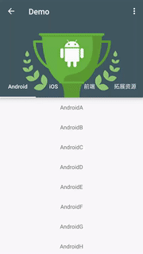
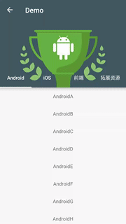

# CoordinatorTabLayout

[](https://github.com/hugeterry/CoordinatorTabLayout/blob/master/LICENSE.txt)
[ ](https://bintray.com/hugeterry/CoordinatorTabLayout/CoordinatorTabLayout/_latestVersion)

CoordinatorTabLayout是一个自定义组合控件,可快速实现TabLayout与CoordinatorLayout相结合的样式
继承至CoordinatorLayout, 在该组件下面使用了CollapsingToolbarLayout包含TabLayout

[相关文档介绍:http://hugeterry.cn/dreams/559](http://hugeterry.cn/dreams/559)


## 用法

### Step 1

在gradle文件中加入下面的依赖:
```
dependencies {
    compile 'cn.hugeterry.coordinatortablayout:coordinatortablayout:1.0.6'
}
```

### Step 2

在你自己的XML中使用它:
```
<cn.hugeterry.coordinatortablayout.CoordinatorTabLayout xmlns:android="http://schemas.android.com/apk/res/android"
    xmlns:app="http://schemas.android.com/apk/res-auto"
    android:id="@+id/coordinatortablayout"
    android:layout_width="match_parent"
    android:layout_height="match_parent">

    <android.support.v4.view.ViewPager
        android:id="@+id/vp"
        android:layout_width="match_parent"
        android:layout_height="match_parent"
        app:layout_behavior="@string/appbar_scrolling_view_behavior" />
</cn.hugeterry.coordinatortablayout.CoordinatorTabLayout>
```


### Step 3

</br>
在使用它的界面添加以下设置:</br>
1.`setTitle(String title)`:设置Toolbar标题</br>
2.`setupWithViewPager(ViewPager viewPager)`:将写好的viewpager设置到该控件当中</br>
3.`setImageArray(int[] imageArray)`:根据tab数量设置好头部的图片数组，并传到该控件当中
```
        //构建写好的fragment加入到viewpager中
        initFragments();
        initViewPager();
        //头部的图片数组
        mImageArray = new int[]{
                R.mipmap.bg_android,
                R.mipmap.bg_ios,
                R.mipmap.bg_js,
                R.mipmap.bg_other};

        mCoordinatorTabLayout = (CoordinatorTabLayout) findViewById(R.id.coordinatortablayout);
        mCoordinatorTabLayout.setTitle("Demo")
                .setImageArray(mImageArray)
                .setupWithViewPager(mViewPager);
```

大功告成，好好享用吧


## 更多功能

### 添加折叠后的颜色变化效果



`setImageArray(int[] imageArray, int[] colorArray)`:如果你想要有头部折叠后的颜色变化，可将之前设置好的图片数组以及根据tab数量设置的颜色数组传到该控件当中
```
        mColorArray = new int[]{
                android.R.color.holo_blue_light,
                android.R.color.holo_red_light,
                android.R.color.holo_orange_light,
                android.R.color.holo_green_light};
        mCoordinatorTabLayout.setImageArray(mImageArray, mColorArray);
 ```

### 添加返回

`setBackEnable(Boolean canBack)`:设置Toolbar的返回按钮
```
    @Override
    protected void onCreate(Bundle savedInstanceState) {
        ...
        mCoordinatorTabLayout.setBackEnable(true);
        ...
    }
    @Override
    public boolean onOptionsItemSelected(MenuItem item) {
        if (item.getItemId() == android.R.id.home) {
            finish();
        }
        return super.onOptionsItemSelected(item);
    }
```

### 通过网络加载头部图片

选择用网络来加载图片。可实现以下接口:
`setLoadHeaderImagesListener(LoadHeaderImagesListener loadHeaderImagesListener)`:设置获取头部图片的操作
```
    @Override
    protected void onCreate(Bundle savedInstanceState) {
        ...
        mCoordinatorTabLayout.setTitle("Demo")
                .setBackEnable(true)
                .setContentScrimColorArray(mColorArray)
                .setLoadHeaderImagesListener(new LoadHeaderImagesListener() {
                    @Override
                    public void loadHeaderImages(ImageView imageView, TabLayout.Tab tab) {
                        switch (tab.getPosition()) {
                            case 0:
                                //加载图片
                                break;
                            ...
                        }
                    }
                })
                .setupWithViewPager(mViewPager);
    }
```
你也可以选择用Glide/Picasso等网络框架来实现，[代码例子](https://github.com/hugeterry/CoordinatorTabLayout/blob/master/sample/src/main/java/cn/hugeterry/coordinatortablayoutdemo/LoadHeaderImageFromNetworkActivity.java)

### 获取子控件

`getActionBar()`:获取该组件中的ActionBar<br/>
`getTabLayout()`:获取该组件中的TabLayout<br/>
`getImageView()`:获取该组件中的ImageView

[更多代码](https://github.com/hugeterry/CoordinatorTabLayout/blob/master/sample/src/main/java/cn/hugeterry/coordinatortablayoutdemo/MainActivity.java)


## 属性

- `app:contentScrim` -> color.默认为?attr/colorPrimary
- `app:tabIndicatorColor` -> color.
- `app:tabTextColor` -> color.

## Demo
[http://fir.im/ctlayout](http://fir.im/ctlayout)

## LICENSE
    Copyright 2017 HugeTerry.
    Licensed under the Apache License, Version 2.0 (the "License");
    you may not use this file except in compliance with the License.
    You may obtain a copy of the License at

       http://www.apache.org/licenses/LICENSE-2.0

    Unless required by applicable law or agreed to in writing, software
    distributed under the License is distributed on an "AS IS" BASIS,
    WITHOUT WARRANTIES OR CONDITIONS OF ANY KIND, either express or implied.
    See the License for the specific language governing permissions and
    limitations under the License.

